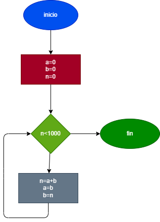

# la serie fibonacci es una secuencia numerica, en la cual cada elemnto es igual ala suma de los dos anteriores. tomando como variables iniciales los dos primeros elementos A=0 y B=1 hacer el diagrama y prorama en paython que calcule e imprima apartir del tercero todos los elemntos de la serie de fibonacci que sean menores que 1000

